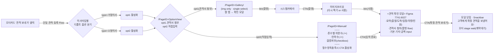

# PRD — 견적서 단일 등록 Flow (1-A)

| 항목 | 내용 |
|---|---|
| Flow ID | **1-A · 단일 견적 등록** |
| 작성자 | jisun |
| 작성일 | 2026-06-29 |
| 상태 | Draft v2 (프로토타입 · Figma 7741:6027 정렬) |
| 대상 | 이사 파트너(사장님센터) |
| 진입점 | 상담중 탭 오더카드 **`견적 보내기`** |
| 관련 | [Notion · Flow (UXD)](https://app.notion.com/p/ohouse/Flow-38ea597878a080c990aee94365d9a592?source=copy_link) · [Notion 1-A](https://app.notion.com/p/ohouse/Flow-38ea597878a080c990aee94365d9a592?source=copy_link) · [`PRD_Partner_Quotation_복수등록Flow.md`](PRD_Partner_Quotation_복수등록Flow.md) · `Persona_Parnter_UserJourney.md` · Figma [`7741:6027`](https://www.figma.com/design/XAuVyol5mvq7H0queuWQt4/-B2B--%EC%9D%B4%EC%82%AC-%ED%8C%8C%ED%8A%B8%EB%84%88%EC%84%BC%ED%84%B0?node-id=7741-6027) |

> **한 줄 정의**: 확정된 **오더 1건**에 대해 먹지 견적서를 **첨부(갤러리) 또는 직접입력**으로 등록하고, 금액·신청정보를 검증한 뒤 **확정 견적 보내기**로 제출한다. 제출 즉시 해당 오더는 `wait`(고객 계약 대기)로 전이되고 **고객 계약 확인 Flow**로 직결된다(운영 검수 없음).

---

## 1. 배경 & UXD Summary

> **UXD ground truth**: [Notion · Flow](https://app.notion.com/p/ohouse/Flow-38ea597878a080c990aee94365d9a592?source=copy_link) — 프로토타입 우측 패널 **UXD Summary**와 동기화.

### 1.0 비즈니스 배경

- 견적·계약이 주로 **인앱 밖 채널**(전화·문자)에서 이뤄지면서 외부로 이탈되고, 거래 데이터가 인앱에 남지 않는다.
- 오늘의집 **책임보장 파트너사**는 견적을 기반으로 수수료를 수취하는 구조라, 정확한 견적·계약 데이터의 **인앱 확보**가 정산·수익의 전제가 된다.

### 1.1 고객 정의

**[유저1: 이사 파트너]**

- 여러 이사 플랫폼(중개앱·카페·전화 등)을 병행 활용 → **앱 내 입력 최소화**가 견적 등록의 핵심 관건.
- 이사 유형별 현장 견적 산출 방식이 달라 **단일 입력 흐름**만 제공하면 불편 예상.
  - **가정이사**: 방문 견적·현장 먹지 작성에 익숙 → 앱 내 입력 최소화 필요.
  - **소형이사**: 전화·간단한 방식으로 견적 전달하는 경우가 잦음.

**[유저2: 이사 상담 유저]**

- 매칭 이후 견적·금액 조율 등 핵심 액션이 **문자·카카오톡** 등 앱 밖에서 일어나 경험이 끊김.
- 앱 밖 견적·조율 과정이 트래킹되지 않아 **계약 진행 상태 확인·경험 관리**가 어려움.

### 1.2 UX Goal

| 대상 | Goal |
|---|---|
| **파트너** | 파트너단의 입력을 최소화하여 **견적 등록 허들**을 낮춘다. |
| **일반유저** | 매칭 이후 끊기던 경험을 **실제 계약 완료까지 앱 안**에서 이어간다. |

### 1.3 솔루션 제안 & 고도화 방향

1. 이사 유형에 따라 입력 방식(**견적서 첨부 / 직접 입력**)을 다르게 제공하되, **파트너가 입력 방식을 선택**할 수 있다.
2. 견적 변동 factor인 **인원·할증** 등 핵심 항목 중심으로 입력을 최소화한다.

### 1.4 Flow 시나리오 — 언제 쓰는가

- 파트너가 **특정 상담중 리드(오더) 1건**의 견적을 등록할 때.
- 오더·신청정보가 **진입 시점에 이미 확정** → OCR/폼은 금액·차량·인력 보완용.

### 1.5 페르소나별 디폴트

| 신청 유형 | 디폴트 옵션 | 근거 |
|---|---|---|
| **가정이사** (P1 · 방문) | opt1 **견적서 첨부**(Gallery) | 현장 먹지 촬영·앨범 선택 |
| **소형이사** (P2 · 비대면) | opt2 **직접입력**(Manual) | 사진·전화 기반 간단 견적 → 폼 입력 |

### 1.6 단일 vs 복수 (한눈에)

| | 단일 (본 문서) | 복수 ([복수등록Flow](PRD_Partner_Quotation_복수등록Flow.md)) |
|---|---|---|
| 진입 | 오더카드 `견적 보내기` | FAB `견적 한번에 등록` |
| 오더 연결 | **진입 시 확정** | **OCR 매칭 후 확정** |
| 등록 건수 | **1건** | N건 |
| 옵션 | OptionView 2토글 | Gallery 직진(토글 없음) |
| 제출 | 확인 모달 → **확정 견적 보내기** | 목록 누적 → **견적 검토 요청 (n장)** |

---

## 2. Flowchart

---

## 3. 화면 스펙 (PageID)

### 3.1 OptionView (`/PageID=OptionView/`)

- **2옵션 토글**: `견적서 첨부` | `직접 입력`
- 가정이사 → opt1, 소형이사 → opt2 **자동 선택**
- 사용자가 토글로 변경 가능

### 3.2 Gallery — 견적서 첨부 (`/PageID=Gallery/`)

| 영역 | 스펙 |
|---|---|
| 헤더 | X(닫기) · 제목 **`견적서 등록`** |
| 토글 | `견적서 첨부` \| `직접 입력` (단일 flow only) |
| 앨범 | `최근 사진` 드롭다운 · **4열** 그리드 |
| 그리드 | img only · **single select** · 선택 시 **보라색 inset 테두리 + 30% dim** (순번 뱃지 없음) |
| 셀 탭 | **즉시 견적 확인 모달** 진입 (별도 헤더 확인 CTA 없음) |
| 촬영 | 그리드 **촬영** 셀 → **시스템 카메라** → CTA(촬영) → **이미지 프리뷰** |
| 프리뷰 | 하단 `다시 찍기` \| **`사용`** → **견적 확인 모달** |
| Desktop | 드래그앤드롭 · `이미지 선택` 파일 피커 |

> 단일 flow는 **견적 1건 · 이미지 1장** 기준. (복수 flow의 multi select·목록 누적과 구분)

### 3.3 Manual — 직접입력 (`/PageID=Manual/`)

| 필드 | UI | 필수 |
|---|---|---|
| 차량 | 1톤 / 2.5톤 / 5톤 각 −/+ 스테퍼 | 합계 ≥ 1 |
| 인력 | 이사 인력 수 −/+ | ≥ 1 |
| 할증 | checkbox | 선택 |
| CTA | **`입력 완료`** — 차량·인력 충족 시 활성 | |

- **금액(기본/기타)** 은 Manual이 아닌 **견적 확인 모달**에서 입력.

### 3.4 견적 확인 모달 — Figma `7741:6027`

**컨테이너 (ODS Bottom Sheet)**

| 영역 | 스펙 |
|---|---|
| Grabber | pill **32×4** · padding `8px 16px 4px` |
| 헤더 | 제목 **`견적 확인`** · X 닫기 · min-height 44px |
| Body | padding `0 16px 8px` · 세로 스크롤 |
| Footer | padding `10px 16px` + safe-area · gap **8px** · 버튼 height **44px** |

#### 3.4.1 요약

| 항목 | 스펙 |
|---|---|
| 섹션 타이틀 | **`요약`** |
| 행 | **출발지** · **도착지** · **이사예정일** · **차량** · **인원** |
| 이사예정일 포맷 | `YYYY.MM.DD 요일` (예: `2026.06.30 월`) |
| 타이포 | 타이틀 **Body16 Bold** 16/20 · 행 **Body14 Regular** 14/18 · 라벨 width **78px** weak · 값 **좌측 정렬** · 행 gap **10px** |
| 구분선 | 1px divider · margin-bottom **16px** |

> 이름·연락처는 요약 블록에 노출하지 않음 (오더 컨텍스트 확정).

#### 3.4.2 견적서 (촬영 flow only)

| 항목 | 스펙 |
|---|---|
| 표시 조건 | Gallery(견적서 첨부) flow · 직접입력 flow에서는 **미노출** |
| 섹션 타이틀 | **`견적서`** · Body16 Bold |
| 썸네일 | **1장** · full-width · height **120px** · radius **8px** |
| 오버레이 | 하단 **5% linear gradient dim** |
| 인터랙션 | 썸네일 전체 탭 → 줌 · 우하단 pill **`크게 보기`** |

#### 3.4.3 확정 견적

| 항목 | UI | 타이포 / 레이아웃 |
|---|---|---|
| 섹션 타이틀 | **`확정 견적`** | Body16 Bold 16/20 |
| **기본 금액** | Input + 단위 **`만원`** (input 밖) | 라벨 Bold · input **Body15 Semibold** 15/24 · 우측 정렬 · **80×40** · placeholder **`0`** |
| **기타 비용** | 서브 **`사다리차, 분해·설치 등`** + Input + `만원` | 서브 **Detail13** 13/18 weak · input 동일 |
| **총 계약금액** | 회색 박스 · **`VAT 제외`** · 실시간 합산 | 좌 **Body15 Semibold** + em 13/18 · 우 **Heading18 Semibold** 18/24 · padding **16px 20px** · radius **12px** |

#### 3.4.4 Footer CTA

| 버튼 | 스펙 |
|---|---|
| **견적 수정** | secondary(normal) · flex **1** |
| **확정 견적 보내기** | primary(brand-solid) · flex **2.76** · **기본+기타 합계 > 0** 일 때 활성 |
| **견적 수정** 동작 | 등록 화면(Gallery / 직접입력)으로 복귀 |

#### 3.4.5 제출 후

| 항목 | 스펙 |
|---|---|
| 모달 | 닫힘 |
| 피드백 | ODS Snackbar **`고객에게 확정 견적을 보냈어요! 계약 확인 시 알림으로 알려드릴게요.`** · **3초** · dim 없음 |
| 오더 | stage **`need → wait`(계약대기)** · 헤더 뱃지 **계약대기** · CTA **견적서 확인** |

> 단일 flow는 별도 done 풀스크린("고객에게 계약 확인 요청을 보냈어요!") 없이 **Snackbar** 로 종료.

---

## 4. OCR · 검증

| 항목 | 단일 flow 동작 |
|---|---|
| 오더 매칭 | **불필요** — 진입 오더로 고정 |
| OCR 역할 | 먹지 이미지에서 품목·금액 **초안** 추출(저신뢰 필드 하이라이트) |
| 금액 | OCR 값은 **초안** — 파트너 **확인 필수** 후 제출 |
| 실패 | 재촬영 또는 직접입력(opt2) 폴백 |

---

## 5. 요구사항 (FR)

| ID | 요구사항 |
|---|---|
| FR-S1 | 오더카드 **`견적 보내기`** 클릭 시 해당 오더 **단일 flow** 진입, 신청정보 자동 프리필 |
| FR-S2 | 이사타입별 OptionView 디폴트: 가정→견적서 첨부, 소형→직접입력 |
| FR-S3 | Gallery: img only · **single select** · 셀 탭 또는 촬영 `사용` 시 **견적 확인 모달** 진입 |
| FR-S4 | Gallery 촬영 → 시스템 카메라 → 프리뷰 → **`사용`** 시 확인 모달 |
| FR-S5 | Manual: 차량·인력 필수 충족 전 **`입력 완료`** 비활성 |
| FR-S6 | 견적 확인 모달: **기본·기타 금액 합계 > 0** 전 **`확정 견적 보내기`** 비활성 |
| FR-S7 | 제출 시 해당 오더 stage `need → wait`(계약대기), 카드 뱃지·CTA 갱신 |
| FR-S8 | 제출 즉시 **고객 계약확정 넛지** 트리거(운영 검수 없음) |
| FR-S9 | 제출 후 견적 확인 **모달 닫힘** + Snackbar **`고객에게 확정 견적을 보냈어요! 계약 확인 시 알림으로 알려드릴게요.`** 3초 노출 |
| FR-S10 | 작성 중 이탈 draft 저장·이어쓰기(P1) |

---

## 6. IA · 상태

- **위치**: `/moving/steps` · 상담중 탭 · `견적 작성 필요` 카드
- **뱃지**: `need` → (제출 후) `wait` → (고객 계약 후) `done`
- **estimate ver** 에서만 활성 · prod ver 는 기존 `계약 확정` 유지

---

## 7. 엣지 케이스

- **금액 오인식** → OCR 자동 확정 금지, 확인 모달에서 반드시 검증
- **손글씨/조명/글레어** → 프리뷰에서 재촬영 또는 opt2 직접입력
- **wait 이후 수정** → 고객 계약 진행 중 임의 수정 차단(P1: 회수/재제출 정책)
- **0원 제출** → `기본·기타 금액을 입력해주세요` 토스트 · CTA 비활성

---

## 8. 프로토타입 정합 (`index.html` · ver=estimate)

| 스펙 | 프로토타입 |
|---|---|
| 진입 CTA | **`견적 보내기`** |
| OptionView | `견적서 첨부` \| `직접 입력` |
| Gallery | `견적서 등록` · single select · 셀 탭 → 모달 |
| Manual CTA | `입력 완료` |
| 확인 모달 | `견적 확인` · Figma **7741:6027** 타이포·패딩 |
| 요약 필드 | 출발지 · 도착지 · 이사예정일 · 차량 · 인원 |
| 금액 라벨 | `기본 금액` · `기타 비용` (서브: 사다리차, 분해·설치 등) |
| Footer | `견적 수정` \| `확정 견적 보내기` |
| 제출 | 모달 닫힘 · Snackbar `고객에게 확정 견적을 보냈어요! 계약 확인 시 알림으로 알려드릴게요.` · stage `wait` |

---

## 9. DoD

- [ ] 가정/소형 이사타입별 디폴트 OptionView 동작
- [ ] Gallery single-select · 촬영 · 프리뷰 · 확인 모달 연결
- [ ] Manual 게이팅 · `입력 완료` → 모달 연결
- [ ] 확인 모달 Figma 7741:6027 타이포·패딩·CTA 비율(1:2.76)
- [ ] 금액 게이트 · `확정 견적 보내기` · Snackbar · stage `wait` 전이
- [ ] 고객 계약 Flow 직결(Notion [Flow](https://app.notion.com/p/ohouse/Flow-38ea597878a080c990aee94365d9a592?source=copy_link) · stage `wait` → 고객 넛지)

---

## 10. 오픈 이슈

- OCR 정확도 목표·저신뢰 필드 정의
- draft 이어쓰기 UX(P1)
- `계약 확정` → **`견적 보내기`** 라벨 변경 파트너 커뮤니케이션
